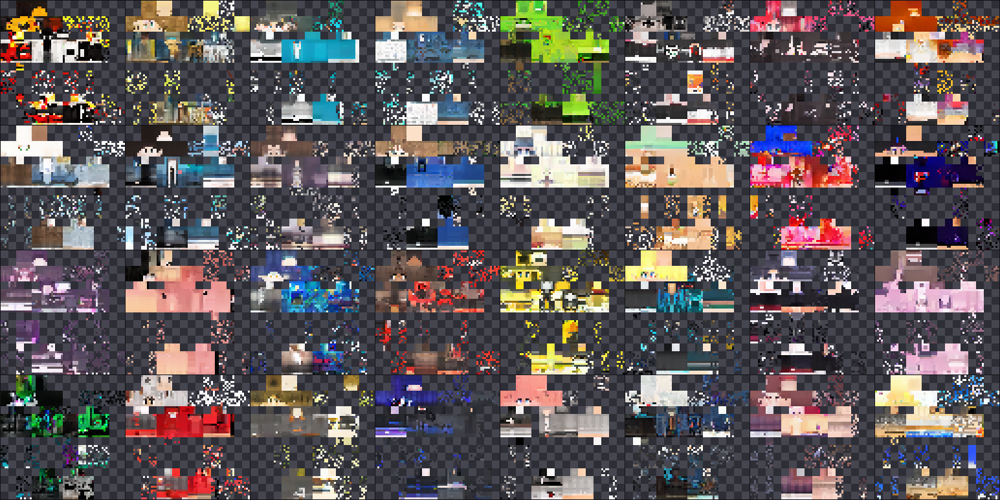
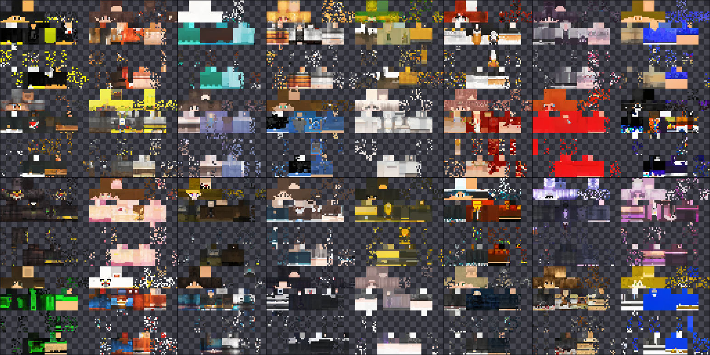
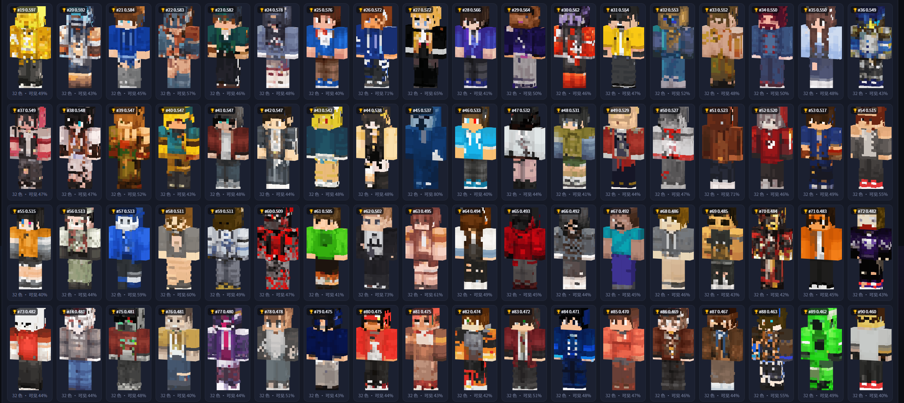

<div align="center">

<h1 align="center">drmage-1.0-flash-preview</h1>


<p>
  
  
  
  
</p>
<p><strong>一个能在 8GB 消费级显卡上训练的 Minecraft 皮肤（64×64 RGBA）像素空间扩散模型（DDPM）</strong></p>
<p>
  本发布只包含一个模型：<code>diff_v2_masked</code><br>
  （687,400 步 / 312 epoch 的 EMA 权重）
</p>

</div>

## 1. 这是什么

> **实验预览性质的MC皮肤扩散模型**（experimental preview）
> 输入一段 36 维条件向量（色调 / 饱和度 / 明度 / 复杂度 / 骨架类型……），
> 输出一张 **64×64 RGBA** 的 Minecraft 皮肤（classic / Steve 骨架，4px 手臂）：

* **像素空间 DDPM**：SmallUNet（base 64）+ cosine schedule（T=1000）+ DDIM 采样；
* **alpha 与内容解耦**：模型只学 RGB，alpha 由真实皮肤 mask 库检索给出
  （`models/mask_bank.npz`），导出的 alpha 严格 0/255；
* **掩码损失**：损失只在可见像素上算（这正是「masked」的含义，
  也是相对上一版唯一的本质差异——上一版 overlay 区域被学成暗色）；
* **条件模型**：36 维条件向量 FiLM 式注入（详情见 `docs/ARCHITECTURE.md`）。

**性质声明：这是实验预览，不是成品工具。** 生成的皮肤「第一层（皮肤本体）
基本可用，第二层（帽子 / 外套等 overlay）明显偏乱」——这是已知的主要缺陷，
详见 `docs/MODEL_CARD.md` 的指标与限制一节，不要对本版的第二层质量有期待。

## 1.5 效果示例

训练过程固定噪声快照（同一起点，左：3.6 万步早期，右：68.6 万步最终）——
第二层的椒盐观感是训练期快照用的合成模板所致，推理端已改为真实 mask 检索，
见 `docs/PIPELINE_ABLATION.md`：





## 2. 快速开始

环境：**Windows**（两个 webui 用了 Win32 API；训练 / 生成脚本本身跨平台）、
Python 3.10+、`torch`（CUDA 版推荐，CPU 也能跑只是慢）、`numpy`、`pillow`。

```bash
pip install -r requirements.txt        # torch 2.2.0 / numpy 1.26.4 / pillow
```

### 2.1 命令行生成 8 张皮肤

```bash
python scripts/30_generate.py --model diffusion \
    --ckpt models/diff_v2_masked/ema.pt \
    --n 8 --batch 8 --ddim-steps 50 --seed 42 --out my_first_run
# 产物：data/generated/my_first_run/skin_XXXX.png + manifest.csv + contact_sheet.png
```

带条件生成（JSON，字段含义见 `docs/ARCHITECTURE.md` §3）：

```bash
python scripts/30_generate.py --model diffusion --ckpt models/diff_v2_masked/ema.pt \
    --n 8 --ddim-steps 50 \
    --cond-spec '{"tone":"dark","complexity_class":"detailed","model_type":"classic"}' \
    --quantize 64 --out dark_detailed
```

### 2.2 推理 WebUI（推荐）

```bash
python webui/infer/server.py            # http://127.0.0.1:8850
python webui/infer/server.py --preload  # 启动即载权重，首屏就能出图
```

三种条件来源：**滑块合成**（捏条件）/ **真实抽样**（抽真实条件对照）/
**抽奖模式**（抽 N 条真实条件各生成一张，学习型评分器挑出最好的几张交付，
见 `docs/LOTTERY.md`）。出图后可在 canvas 3D 人形预览（可旋转）、
逐张指标弹窗查看评分明细、导出 zip（可选「仅第一层」）。
后处理含**破洞修补**（第一层孤立透明像素自动填补，默认开）与自适应量化。
只监听 127.0.0.1。

### 2.3 训练监控 WebUI

```bash
python webui/server.py                  # http://127.0.0.1:8848
```

本发布**锁定单一实验** `diff_v2_masked`：开箱即显示随仓库附带的
687,400 步完整训练历史（曲线 / 快照 / 断点档案 / 中文事件流），
也可以从面板直接启动 / 停止训练（内置「两阶段官方配方」预设）。

> 两个面板是独立进程、独立端口，可同时开；训练监控端用了 Win32 API 读
> 系统指标，非 Windows 环境系统指标会显示为空，但训练/推理功能不受影响。

## 3. 仓库内容

| 路径                                                      | 说明                                                                                                                                             |
| --------------------------------------------------------- | ------------------------------------------------------------------------------------------------------------------------------------------------ |
| `models/diff_v2_masked/{ema.pt, latest.pt}`             | **发布权重**。`ema.pt`（48MB）出图用；`latest.pt`（190MB）含优化器状态，供续训                                                         |
| `models/diff_v1/{ema.pt, latest.pt}`                    | 阶段一预训练权重（两阶段复现链条的中间产物，见 `docs/REPRODUCE.md`）                                                                           |
| `models/mask_bank.npz` + `models/alpha_rates.json`    | 真实 alpha mask 库（推理时检索）与逐面覆盖率                                                                                                     |
| `data/processed/*.npy`                                  | 预处理好的数据集：train 105,605 / val 13,200 / test 13,200，`(N,4,64,64) uint8` + 条件矩阵（约 2.2GB，只为训练复现准备；只想推理可整目录删除） |
| `data/clean_manifest.csv`、`labels/annotations.jsonl` | 数据集宽表清单与四层标注（训练时条件向量从这里构建）                                                                                             |
| `scripts/`                                              | 数据管线 → 训练 → 生成 → 验证 全链路脚本（见 §5）                                                                                            |
| `webui/`                                                | 训练监控面板 + 推理实验台（纯 Python 标准库，零第三方依赖）                                                                                      |
| `logs/diff_v2_masked/`                                  | 这次训练的完整记录：metrics.jsonl（6,342 条）、train.log、损失曲线、275 张固定噪声快照                                                           |
| `docs/`                                                 | `REPRODUCE.md`（从零复现）/ `MODEL_CARD.md`（模型卡：指标、限制、许可）/ `ARCHITECTURE.md`（结构与设计）                                   |

## 4. 训练概况（详见 MODEL_CARD / REPRODUCE）

| 项       | 值                                                                                                        |
| -------- | --------------------------------------------------------------------------------------------------------- |
| 架构     | SmallUNet base=64 · t_dim=256 · T=1000 cosine · 条件 36 维                                             |
| 两阶段   | 阶段一 `diff_v1`（无掩码损失，~81,400 步）→ 阶段二 `diff_v2_masked`（+ 掩码损失，续训至 687,400 步） |
| 数据     | 132,090 张去重后真实皮肤（三来源，全部 classic），train 105,605                                           |
| 硬件     | RTX 2080 SUPER 8GB（峰值显存 4.6GB，batch 48 + AMP）                                                      |
| 最终损失 | masked MSE 0.0428（最优 0.0410），EMA decay 0.9995                                                        |

## 5. 全链路脚本（数据从零重建时用；本仓库已附带处理好的数据集）

```
00_env_check.py     环境自检（GPU / CUDA / 依赖 / 磁盘）
01b_fetch_hf.py     拉取 HuggingFace 上的两个公开皮肤集合
02a/02b/02c_ingest  三源摄取：UV 校验 + 骨架判别 + 质量打分 → 宽表 CSV
02_clean.py         清洗 + 精确/近似去重（multi-index LSH）
10_label.py         四层标注（纯 CSV 运算）
04_dataset.py       构建 train/val/test npy + 条件矩阵
25_build_mask_bank.py  从训练集构建真实 alpha mask 库
21_train_diffusion.py  DDPM 训练（本发布的主角）
30_generate.py      批量生成 + 逐样本统计
31_validate.py      五关验证（格式 / 结构 / alpha / 分布 / 记忆检查）
33_train_lottery_scorer.py  抽奖评分器（真实 vs 生成 判别器）
34_verify_scorer.py  评分器验收：复现对照轮次，打印新旧名次
35_pipeline_ab.py    训练快照 vs 推理管线消融（第二层收益来源实证）
```

各步骤的命令、参数与顺序见 `docs/REPRODUCE.md`。

## 6. 已知限制（诚实版，完整清单见 MODEL_CARD）

* **第二层（overlay）质量差**：色熵 0.868 对真实 0.416，≥8px 同色块覆盖率
  0.0014 对真实 0.1388——「色系能对，结构是乱的」。这是本版的主要缺陷。
  推理端的 mask 检索/量化/修补能显著改善**显示观感**（见
  `docs/PIPELINE_ABLATION.md`），但模型盲画第二层的结构性缺口要靠
  `--alpha-input` 一类训练侧改造解决。
* **只支持 classic（Steve）骨架**：13 万样本里 slim 格式纹理只有个位数，slim 属分布外。
* **`quality_tier` 分不清「精细」和「噪声」**，判断生成质量请看唯一色数 / 色熵等分布指标。
* 数据与产物的许可与署名要求、与 Mojang 的关系声明，见 `docs/MODEL_CARD.md`。

## 7. 作者与许可

作者：**hcy_neo、Bonfire、DRM**（联系邮箱：hr1234562345@outlook.com）。

代码以 **GPL-3.0-or-later** 发布（`LICENSE`）。数据与权重的许可继承了
上游数据集的条款（Apache-2.0 / MIT），详见 `docs/MODEL_CARD.md` §许可。
本项目与 Mojang / Microsoft 无关，未被官方认可。

